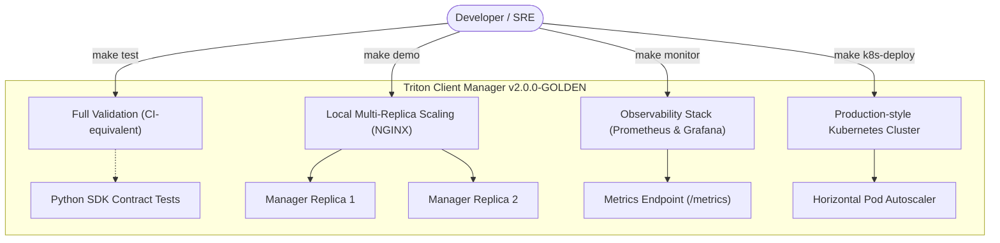

<p align="center">
  
</p>

# Triton Client Manager

**v2.0.0-GOLDEN — The Zero‑Copy Era**

> A modern, enterprise-grade orchestration service for AI inference that coordinates OpenStack VMs, Docker containers, and NVIDIA Triton Inference Server via WebSockets. It provides multi-tenant scheduling (DRR), operational guardrails, and production-grade observability.

**Breakthrough (v2.0.0-GOLDEN):** **Zero‑Copy Shared Memory orchestration** — for large tensors, clients send **POSIX SHM metadata** and the Manager avoids ingesting tensor bytes.

[](https://www.python.org/)
[](https://fastapi.tiangolo.com/)
[](https://www.uvicorn.org/)
[](https://www.docker.com/)
[](https://github.com/triton-inference-server/client)
[](https://github.com/adrirubim/triton_client_manager/actions/workflows/tests.yml)
[](https://github.com/adrirubim/triton_client_manager/actions/workflows/lint.yml)
[](LICENSE)

## 📋 Table of Contents

- [Operational Quickstart](#operational-quickstart)
- [Overview](#overview)
- [Features](#features)
- [Tech Stack](#tech-stack)
- [Requirements](#requirements)
- [Installation](#installation)
- [Security](#security)
- [Documentation](#documentation)
- [CI/CD](#cicd)
- [Testing](#testing)
- [Architecture](#architecture)
- [Optional Tooling](#optional-tooling)
- [Project Status](#project-status)
- [Default Users](#default-users-development)
- [Useful Commands](#useful-commands)
- [Before Pushing to GitHub](#before-pushing-to-github)
- [Contributing](#contributing)
- [Author](#author)
- [License](#license)

---

<a id="operational-quickstart"></a>
## ⚙️ Operational Quickstart

Use these `make` targets from the **repository root** as the single source of entry for running, validating, and deploying Triton Client Manager:

| Command           | Purpose                                                           | Notes                                                                                 |
| ----------------- | ----------------------------------------------------------------- | ------------------------------------------------------------------------------------- |
| `make test`       | **Full validation** (pytest + smoke + SDK contract tests)        | Runs the full Python test suite under `apps/manager/`, including WebSocket SDK contracts. |
| `make demo`       | **Multi-replica scaling demo with NGINX**                        | Starts `docker-compose.multi-node.yml` (two manager replicas behind an NGINX LB).     |
| `make monitor`    | **SRE observability stack (Prometheus/Grafana)**                 | Brings up the monitoring stack in `infra/monitoring/docker-compose.yml`.             |
| `make k8s-deploy` | **Production-style Kubernetes deployment (Deployment + HPA etc.)** | Applies manifests from `infra/k8s/` and prepares the cluster for autoscaling validation. |

These commands are designed so that any **developer or SRE** can get from clone to:

- A validated runtime (`make test`),
- A horizontal-scaling demo (`make demo`),
- A full observability stack (`make monitor`),
- And a Kubernetes deployment with HPA (`make k8s-deploy`)

with **one command per scenario**.

For deeper operational details and configuration options, see:

- **Technical guide:** [TECHNICAL_GUIDE.md](TECHNICAL_GUIDE.md)
- **Version stack:** [VERSION_STACK.md](VERSION_STACK.md)

### Operational entrypoints diagram



---

<a id="overview"></a>
## 🎯 Overview

Triton Client Manager is a **control plane** for AI inference pipelines.  
It receives WebSocket messages from an upstream backend, routes them by type (`info`, `management`, `inference`), and coordinates:

- OpenStack VM creation/deletion
- Docker container lifecycle on those VMs
- NVIDIA Triton Inference Server deployment and health checks

The system exposes inference endpoints (HTTP and gRPC) and manages per-user job queues to ensure fair scheduling and isolation.

### Key Highlights

- **Modern stack:** Python 3.10+ (validated in CI on 3.13), FastAPI, uvicorn, PyYAML, Triton client
- **Container runtime:** `Dockerfile.manager` uses `python:3.13-slim`
- **OpenStack integration:** VM lifecycle, application credentials, region-aware service catalog
- **Docker integration:** Container management for Triton workers
- **Triton integration:** HTTP/gRPC inference, health checks, routing by `vm_id` / `container_id`
- **WebSockets:** Authenticated clients, per-user queues, typed job routing
- **Configuration-first:** YAML-driven configuration for jobs, OpenStack, Docker, Triton, and MinIO
- **Testing:** Smoke runtime test, regression suite, and integration tests for WebSockets
- **Documentation:** Master technical documentation lives in [TECHNICAL_GUIDE.md](TECHNICAL_GUIDE.md)

> **Virtual environment:** this monorepo is validated with a repo-root venv (`.venv/`). Some older references mention `apps/manager/.venv`; prefer the repo-root venv to avoid dependency drift.

---

<a id="features"></a>
## ✨ Features

### 🔐 Security & Stability

- ✅ **WebSocket auth** — Top-level `uuid` required in the first `auth` message
- ✅ **Type validation** — Strict validation for `info`, `management`, and `inference` message types
- ✅ **Config isolation** — YAML config files loaded from [apps/manager/config/](apps/manager/config/), never committed with secrets
- ✅ **OpenStack credentials** — Application credentials used for Keystone auth (ID + secret)
- ✅ **Token management** — Proactive token refresh and region-aware service catalog (`Catalog` helper)
- ✅ **Graceful shutdown** — uvicorn server shutdown via `server.should_exit = True`

### ⚡ Performance & Operations

- ✅ **Per-user queues** — Fair scheduling and isolation across `info`, `management`, and `inference` jobs
- ✅ **Threaded orchestration** — Dedicated threads for OpenStack, Docker, Triton, jobs, and WebSockets
- ✅ **Creation pipeline** — VM → container → Triton server, with rollback on failures
- ✅ **Deletion pipeline** — Triton → container → VM, with flat and nested payload support
- ✅ **Config-driven behavior** — Jobs, OpenStack, Docker, Triton, and MinIO configured via YAML
- ✅ **Observability** — Structured logging with correlation fields and Prometheus metrics exposed at `/metrics`

### 🚀 Zero‑Copy Data Plane (v2.0.0‑GOLDEN)

- ✅ **POSIX Shared Memory (System SHM)** — for large tensors, clients can send **SHM metadata** (`SHMReference`) instead of raw tensor bytes.
- ✅ **Protocol negotiation** — clients can negotiate capabilities at auth time (`capability: ["json", "shm"]`).
- ✅ **Safety-first fallback** — if SHM is unavailable (or not negotiated), the Manager continues to support the classic JSON tensor path.

See: `examples/v2_shm_inference_example.py`.

### 🤝 Protocol Negotiation (capability)

Clients may include a capability list in the `auth` payload:

```json
{
  "uuid": "client-uuid",
  "type": "auth",
  "payload": {
    "capability": ["json", "shm"]
  }
}
```

- If provided, the Manager replies with `type="auth.ok"` and a `payload.capability` list containing the negotiated subset.
- If **not** provided, the Manager replies with the legacy shape `{"type":"auth.ok"}` (no `payload`) to avoid breaking older clients.

### 🧠 Inference Workflows

- ✅ **HTTP inference** — Single request/response via Triton HTTP client
- ✅ **gRPC inference** — Streaming support via Triton gRPC client (planned/experimental; see [TECHNICAL_GUIDE](TECHNICAL_GUIDE.md))
- ✅ **Routing by IDs** — Uses `vm_id` and `container_id` for routing (aligned with Triton server registration)
- ✅ **Payload examples** — Sample management and inference payloads in [apps/manager/payload_examples/](apps/manager/payload_examples/)

### 🏗 Code Quality & Testing

- ✅ **Dependency Injection** — Job threads receive clear dependencies (Docker, OpenStack, Triton, WebSocket)
- ✅ **Regression tests** — Contracts for DI, deletion normalization, auth, and inference examples
- ✅ **Smoke test** — Validates startup, WebSocket auth, and `queue_stats` with mocks
- ✅ **Engineering changelog** — [CHANGELOG](CHANGELOG.md) tracks notable changes for the 1.0.0 line
- ✅ **Observability stack** — Sample Prometheus + Grafana setup with a ready‑to‑use dashboard ([infra/monitoring/](infra/monitoring/), [infra/grafana/tcm_dashboard.json](infra/grafana/tcm_dashboard.json))

### 👥 Target users & use cases

- **Internal MLOps platforms (enterprise)**: platform teams that need to orchestrate OpenStack, Docker, and Triton to provide inference services to many internal teams, with per‑user/tenant queues and SRE‑ready metrics.
- **AI labs and innovation departments**: groups that prototype models and need a reproducible, observable environment to test new models on Triton without fighting infrastructure every time.
- **Multi‑tenant inference SaaS**: products that offer inference as a service to multiple customers and require per‑tenant isolation, rate limiting, role‑based authentication, and a stable WebSocket API + official SDK.
- **SRE / observability teams**: organizations that already have Prometheus/Grafana and want an orchestrator with serious metrics and dashboards from day one (queues, backpressure, per‑job‑type timings, recommended alerts).
- **Backend/frontend integrators**: teams that just want to “talk to Triton” without reading the manager code: they consume the WebSocket API (`/ws`) and the `tcm-client` SDK to send `auth`, `info.queue_stats`, `management`, and `inference` with well‑defined contracts.

---

<a id="tech-stack"></a>
## 🛠 Tech Stack

### Backend

- **Language:** Python 3.10+ (CI validates on 3.13)
- **Framework:** FastAPI
- **ASGI server:** uvicorn
- **Configuration:** PyYAML

### Integration

- **OpenStack** — VM creation/deletion via Keystone-authenticated APIs
- **Docker** — Container lifecycle on worker VMs
- **NVIDIA Triton Inference Server** — HTTP/gRPC inference endpoints
- **MinIO / S3** — Model storage via boto3 (optional)

### Development & Testing

- **Tests:** `unittest`, smoke runtime script, WebSocket integration tests (pytest)
- **Environment:** repo-root venv (`.venv/`) is the recommended default on WSL/Ubuntu

---

<a id="requirements"></a>
## 📦 Requirements

- **Python** ≥ 3.10 (CI validates on 3.13)  
  Check: `python3 --version`
- **Virtual environment** (mandatory on Ubuntu/WSL due to PEP 668)  
  Canonical setup: [TECHNICAL_GUIDE.md](TECHNICAL_GUIDE.md) (venv lives in repo root: `.venv/`)
- **OpenStack access** (for full pipeline)  
  - Keystone URL (`OPENSTACK_AUTH_URL`)
  - Application credential ID and secret
- **Docker** running on the host that manages containers
- **Triton Inference Server** images accessible from Docker (for real inference workflows)

> For local development and smoke tests, mocks are used for OpenStack, Docker, and Triton — no external services required.

---

<a id="installation"></a>
## 🚀 Installation

### 1. Clone the Repository

```bash
git clone https://github.com/adrirubim/triton_client_manager.git
cd triton_client_manager
```

### 2. One-time local setup (venv + deps)

```bash
cd /var/www/triton_client_manager
python3 -m venv .venv
source .venv/bin/activate

python -m pip install --upgrade pip
pip install -r apps/manager/requirements.txt
pip install -e ./sdk
```

Canonical setup and advanced options: [TECHNICAL_GUIDE.md](TECHNICAL_GUIDE.md).

### 4. Configure

- Ensure `config/*.yaml` exists inside `apps/manager/config/`:
  - `jobs.yaml`
  - `websocket.yaml` (compat/dev; recomendado: `websocket.dev.yaml` o `websocket.prod.yaml`)
  - `websocket.dev.yaml` (dev/local)
  - `websocket.prod.yaml` (staging/production)
  - `openstack.yaml`
  - `docker.yaml`
  - `triton.yaml`
  - `minio.yaml` (optional)
- Set your environment-specific values (OpenStack URL, application credentials, Docker host, Triton defaults, MinIO, etc.).
- Optionally, copy `.env.example` at the repository root to `.env` and fill in
  the environment variables for your OpenStack, container registry and MinIO/S3
  credentials (`TCM_ENV`, `OPENSTACK_*`, `REGISTRY_TOKEN`, `REGISTRY_TOKEN_NAME`,
  `MINIO_*`, etc.).

See [TECHNICAL_GUIDE.md](TECHNICAL_GUIDE.md) for full details.

### 6. Run the Application

#### Dev mode (recommended for local development)

Runs only `JobThread` + `WebSocketThread` with mocked OpenStack/Docker/Triton backends. No external services required; ideal for experimenting with `/ws`, `/metrics` and the Grafana dashboard.

```bash
cd apps/manager
source ../../.venv/bin/activate
python dev_server.py
```

#### Full pipeline (requires real OpenStack/Docker/Triton)

```bash
cd apps/manager
source ../../.venv/bin/activate
python client_manager.py
```

### Environment variables (Day‑2 / WSL‑friendly)

Common runtime toggles used for local hardening validation:

- `TCM_ENV=development|staging|production`
- `TCM_PORT=8000` (WebSocket + HTTP server port; `/health`, `/ready`, `/metrics`)
- `TCM_DISABLE_OPENSTACK=1` (development only) — disables OpenStack thread via stub
- `TCM_DISABLE_DOCKER_REGISTRY=1` — disables Docker registry polling to reduce noise in dev
- `TCM_MAX_REQUEST_PAYLOAD_MB=<int>` — enables payload admission control (see 413 below)

> Note: for admission control validation, `TCM_MAX_REQUEST_PAYLOAD_MB` must be set
> on the **manager process** (the running server), not only on the test runner.

### Image tag selection (GHCR)

Some deployment examples reference the GHCR image. You can control which tag to deploy with:

- `TCM_IMAGE_TAG` (for `docker-compose.multi-node.yml`)

Example:

```bash
export TCM_IMAGE_TAG=latest
docker compose -f docker-compose.multi-node.yml up -d
```

Startup sequence:

1. OpenStack thread
2. Triton thread
3. Docker thread
4. Job thread
5. WebSocket thread

Each must report ready within 30 seconds or startup fails with `TimeoutError`.

---

<a id="security"></a>
## 🔒 Security

- **Never commit secrets** — Config files should only contain placeholders or non-sensitive defaults. Real credentials must come from environment variables or secret stores.
- **OpenStack credentials** — Use application credentials (ID + secret); treat them as highly sensitive.
- **Docker/Triton** — Protect Docker and Triton endpoints behind firewalls/VPNs; do not expose them directly to the public internet.
- **Logging** — Avoid logging secrets, tokens, or personally identifiable information.
- **Production** — Use strong credentials; restrict network ingress; monitor logs and metrics.

For vulnerability reporting and security guidelines, see [SECURITY.md](SECURITY.md).

---

<a id="documentation"></a>
## 📚 Documentation

Master documentation files (root):

| Section          | Links                                                                                                                                                    |
| ---------------- | -------------------------------------------------------------------------------------------------------------------------------------------------------- |
| **Technical** | **[TECHNICAL_GUIDE](TECHNICAL_GUIDE.md)** · **[VERSION_STACK](VERSION_STACK.md)** |
| **Policy** | [CONTRIBUTING](CONTRIBUTING.md) · [SECURITY](SECURITY.md) · [CHANGELOG](CHANGELOG.md) · [CODE_OF_CONDUCT](CODE_OF_CONDUCT.md) · [SUPPORT](SUPPORT.md) · [REPO_STANDARD](REPO_STANDARD.md) |
| **Examples** | [`apps/manager/payload_examples/`](apps/manager/payload_examples/) — JSON examples for management and inference payloads |
| **Model Layout** | [`docs/models/README.md`](docs/models/README.md) — strict contract for model docs/templates (no binaries) |

For a navigable, high-level overview, you can also use the
[GitHub Wiki](https://github.com/adrirubim/triton_client_manager/wiki).

---

<a id="cicd"></a>
## 🔄 CI/CD

GitHub Actions (or any other CI) should run tests and basic checks on every push and pull request to the main branch.

**Recommended pipeline steps (validate stage):**

```bash
cd /var/www/triton_client_manager

source .venv/bin/activate

python -m pip install --upgrade pip
pip install -r apps/manager/requirements.txt
pip install -e ./sdk

cd apps/manager
python -m py_compile client_manager.py
python -m compileall -q classes utils
PYTHONPATH=. python tests/smoke_runtime.py --with-ws-client
PYTHONPATH=. python -m unittest discover -s tests -p "test_regression.py" -v
PYTHONPATH=. python -m pytest tests/ -v
```

You can mirror this flow in workflows such as [tests.yml](.github/workflows/tests.yml), [lint.yml](.github/workflows/lint.yml), and [security.yml](.github/workflows/security.yml) to keep the main branch healthy (including dependency and SAST security checks).

---

<a id="testing"></a>
## 🧪 Testing

### Health Endpoints

- `GET /health` — Liveness probe
- `GET /ready` — Readiness probe
  - On failure, returns `503` with a **sanitized** payload (no exception strings / stack traces).
  - Operators can correlate server logs via `error_id`:
    - `{"status":"not_ready","reason":"readiness_probe_failed","detail":"internal_error","error_id":"..."}`

### Smoke Test

**File:** [`apps/manager/tests/smoke_runtime.py`](apps/manager/tests/smoke_runtime.py)
**Purpose:** Runtime validation with mocks (JobThread, WebSocket, auth, info).

```bash
cd apps/manager
source ../../.venv/bin/activate
python tests/smoke_runtime.py
```

**Expected output:** JSON with `startup`, `auth`, and `info`; exit code 0 on success.

### Regression Tests

**File:** [`apps/manager/tests/test_regression.py`](apps/manager/tests/test_regression.py)
**Purpose:** Unit tests for dependency injection, deletion normalization, auth, inference contract, and config.

```bash
cd apps/manager
source ../../.venv/bin/activate
python -m unittest discover -s tests -p "test_regression.py" -v
```

### WebSocket Integration Tests

**File:** [`apps/manager/tests/test_integration_ws.py`](apps/manager/tests/test_integration_ws.py)
**Purpose:** Multi-client WebSocket auth and `info` flow.

```bash
cd apps/manager
source ../../.venv/bin/activate
python -m pytest tests/test_integration_ws.py -v
```

Full details and known caveats are documented in [TECHNICAL_GUIDE.md](TECHNICAL_GUIDE.md).

### Full Test Suite (pytest)

For a full local run that matches CI:

```bash
cd apps/manager
source ../../.venv/bin/activate
python -m pytest tests/ -v
```

Prerequisite: complete the one-time setup in [TECHNICAL_GUIDE.md](TECHNICAL_GUIDE.md).

### SRE validation runner (Day‑2, CI parity)

For Day‑2 validation, use the repo-root runner:

```bash
cd /var/www/triton_client_manager

# Fast: pytest only
bash ./test_suite_master.sh --unit

# Runtime smoke: starts threads + validates WS handshake path
bash ./test_suite_master.sh --smoke

# Full CI parity (delegates to scripts/check.sh: lint + compile + tests + security)
bash ./test_suite_master.sh --full
```

Implementation details and the exact commands are documented in [TECHNICAL_GUIDE.md](TECHNICAL_GUIDE.md).

---

<a id="architecture"></a>
## 🏗 Architecture

Triton Client Manager uses a **threaded orchestration architecture** with clear separation of concerns.

**High-level flow:**

```text
WebSocket → JobThread → JobInfo | JobManagement | JobInference
                             ↓
                 OpenStackThread | DockerThread | TritonThread
```

### Backend Components

| Module                | Responsibility                                                    |
| --------------------- | ---------------------------------------------------------------- |
| `client_manager.py`   | Entry point; loads config, wires dependencies, starts threads   |
| `apps/manager/classes/websocket/` | WebSocket server (FastAPI/uvicorn), auth, type validation |
| `apps/manager/classes/job/` | Per-user queues, routing by type (info, management, inference) |
| `apps/manager/classes/openstack/` | OpenStack auth and VM lifecycle |
| `apps/manager/classes/docker/` | Docker container lifecycle on worker VMs |
| `apps/manager/classes/triton/` | Triton server lifecycle, health checks, inference |
| `tcm/minio/`          | (If present) MinIO / S3 integration for model storage           |

For in-depth diagrams and contracts, see [TECHNICAL_GUIDE](TECHNICAL_GUIDE.md).

---

<a id="optional-tooling"></a>
## 🧩 Optional Tooling

This repository includes some **auxiliary tools** that are _not_ required to run
Triton Client Manager and can be treated as pluggable examples:

- `apps/docker_controller/`:
  - periodic sync script that copies images from a **remote container registry**
    into a **local registry** (by default `localhost:5000`);
  - configured via `apps/docker_controller/config.yaml` (registry URL, project
    identifier, local registry, registry scheme) and environment variables such as
    `REGISTRY_TOKEN` / `REGISTRY_TOKEN_NAME` (generic environment variables
    used to authenticate against the remote registry; you can map them to any
    registry provider);
  - the local registry HTTP API scheme can be overridden via `LOCAL_REGISTRY_SCHEME`
    (`http` or `https`), and the default `start_container.sh` binds the registry
    to `127.0.0.1` for safety unless you intentionally override it.
  - safe to ignore if your deployments already use a different image promotion
    flow (for example, GitHub Container Registry, Docker Hub, or an internal
    registry managed elsewhere).

If you decide to use `apps/docker_controller/` in your own environment, you
should:

- adapt `config.yaml` to point to your registry of choice; and
- provide a **read-only** registry token with the minimum scope required to pull
  images, as described in [SECURITY.md](SECURITY.md).

Triton Client Manager’s **core behavior and CI** do not depend on this tooling;
it exists purely as an optional helper for image lifecycle management.

---

<a id="project-status"></a>
## 📊 Project Status

- **Current release:** **v2.0.0-GOLDEN** — **Zero‑Copy Era**
- **Changelog:** see [CHANGELOG.md](CHANGELOG.md) for highlights and upgrade notes.

This repository now represents the **v2.0.0-GOLDEN production line** for Triton Client Manager, with documentation **synced to the current implementation**. Future changes will follow semantic versioning and be documented in the changelog.

---

## ✅ Production Readiness (v2.0.0‑GOLDEN)

The v2.0.0‑GOLDEN release ships with operator-focused validation entrypoints.

For reproducible commands, see `test_suite_master.sh` and the SRE Validation Suite section in
[TECHNICAL_GUIDE.md](TECHNICAL_GUIDE.md).

---

<a id="default-users-development"></a>
## ⚠️ Default users (development)

Triton Client Manager does **not** ship with fixed default users. Authentication and authorization are typically handled by the upstream system that connects via WebSocket.

For local development and tests:

- The smoke test and integration tests simulate clients and flows without real user accounts.
- Any production deployment should integrate Triton Client Manager with your own auth backend and user model.

**Security:** Ensure that only trusted backends can connect to the WebSocket interface; treat upstream credentials and network access as sensitive.

---

<a id="useful-commands"></a>
## 🛠 Useful Commands

### Run Application

```bash
cd apps/manager

# Dev server (no external services, recommended for local work)
source ../../.venv/bin/activate
python dev_server.py

# Full manager (requires OpenStack/Docker/Triton)
source ../../.venv/bin/activate
python client_manager.py
```

### Smoke & Regression

```bash
cd apps/manager
source ../../.venv/bin/activate
python tests/smoke_runtime.py
python -m unittest discover -s tests -p "test_regression.py" -v
```

### Official SDKs (Python)

An official Python SDK is published for talking to the Triton Client Manager WebSocket API.

- **Package name:** `tcm-client`  
- **Index:** PyPI (`https://pypi.org/project/tcm-client/`)

Install from PyPI:

```bash
python -m pip install --upgrade pip
python -m pip install tcm-client
```

Then use the SDK in your own code:

```python
import asyncio

from tcm_client import AuthContext, TcmWebSocketClient


async def main() -> None:
    uri = "ws://127.0.0.1:8000/ws"

    ctx = AuthContext(
        uuid="my-frontend-1",
        token="opaque-or-jwt-token",
        sub="user-123",
        tenant_id="tenant-abc",
        roles=["inference", "management"],
    )

    async with TcmWebSocketClient(uri, ctx) as client:
        await client.auth()
        info = await client.info_queue_stats()
        print(info)


if __name__ == "__main__":
    asyncio.run(main())
```

The SDK is validated by contract tests ([apps/manager/tests/test_client_sdk_contract.py](apps/manager/tests/test_client_sdk_contract.py)) and mirrors the
runtime behavior of the internal client in [apps/manager/ws_sdk/sdk.py](apps/manager/ws_sdk/sdk.py). For full API contract
details, see [TECHNICAL_GUIDE](TECHNICAL_GUIDE.md).

### Compilation Check

```bash
cd apps/manager
source ../../.venv/bin/activate
python -m py_compile client_manager.py
python -m compileall -q classes utils
```

### Monitoring stack (Prometheus + Grafana)

From the repository root:

```bash
cd infra/monitoring
# Local dev:
docker compose --env-file .env -f docker-compose.yml -f docker-compose.dev.yml up -d
```

Then:

- Prometheus UI at `http://localhost:9090`
- Grafana UI at `http://localhost:3000` (import [infra/grafana/tcm_dashboard.json](infra/grafana/tcm_dashboard.json) and point it to the `prometheus` data source)

---

<a id="before-pushing-to-github"></a>
## 📤 Before Pushing to GitHub

Before opening a pull request, run the full validation flow locally.

Recommended single entrypoint (CI parity):

```bash
./scripts/dev-verify.sh
```

Equivalent manual commands:

```bash
cd apps/manager
source ../../.venv/bin/activate
python tests/smoke_runtime.py --with-ws-client
python -m unittest discover -s tests -p "test_regression.py" -v
python -m pytest tests/test_integration_ws.py -v  # optional but recommended
python -m py_compile client_manager.py
python -m compileall -q classes utils
```

All steps should pass before you push to GitHub and open a PR.

---

<a id="contributing"></a>
## 🤝 Contributing

See [CONTRIBUTING](CONTRIBUTING.md) for local checks, branch/commit conventions, and how to open PRs and issues. This is an open-source project (MIT); for inquiries, contact the author.

### Code Standards

- **Python style**: Follow PEP 8 / PEP 20 and project conventions for layout and imports.
- **Tests**: Write tests for new features; keep smoke and regression suites passing.
- **Documentation**: Keep public contracts and behaviors documented (docs and docstrings) in English.
- **Pull Requests**: PRs must pass the [pull request template](.github/PULL_REQUEST_TEMPLATE.md) checklist and GitHub Actions CI.

---

<a id="author"></a>
## 👨‍💻 Author

**Developed by:** [Adrián Morillas Pérez](https://linktr.ee/adrianmorillasperez)

### Connect

- 📧 **Email:** [adrianmorillasperez@gmail.com](mailto:adrianmorillasperez@gmail.com)
- 💻 **GitHub:** [@adrirubim](https://github.com/adrirubim)
- 🌐 **Linktree:** [adrianmorillasperez](https://linktr.ee/adrianmorillasperez)
- 💼 **LinkedIn:** [Adrián Morillas Pérez](https://www.linkedin.com/in/adrianmorillasperez)
- 📱 **Instagram:** [@adrirubim](https://instagram.com/adrirubim)
- 📘 **Facebook:** [AdRubiM](https://facebook.com/adrirubim)

---

<a id="license"></a>
## 📄 License

MIT — See [LICENSE](LICENSE).

---

**Last Updated:** April 2026 · **Status:** Stable ✅ · **Version:** v2.0.0-GOLDEN · **Stack:** [VERSION_STACK.md](VERSION_STACK.md)

